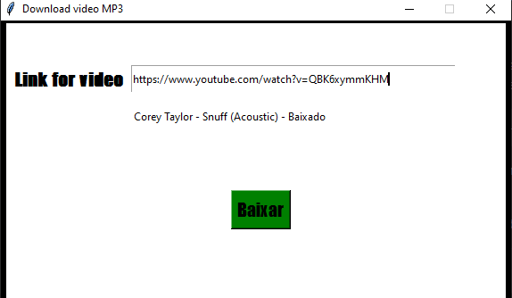
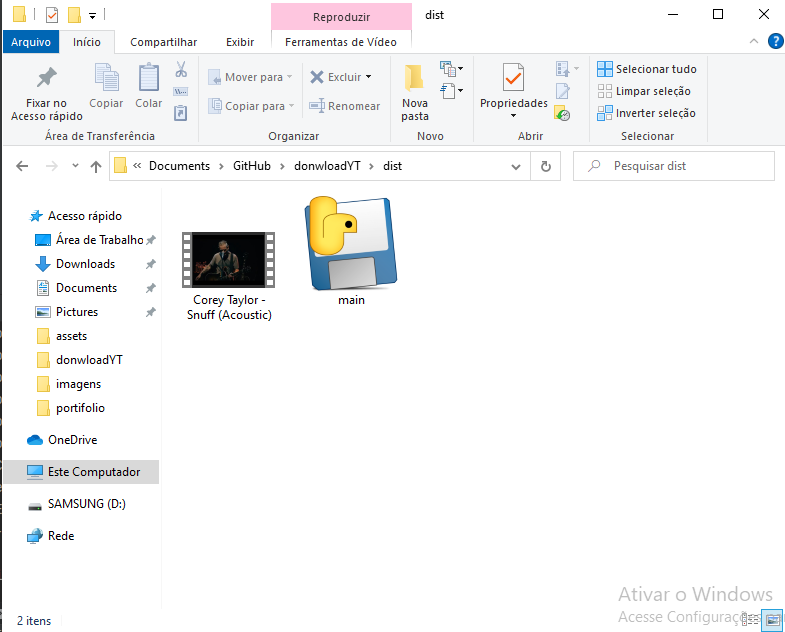

# donwloadYT
 Lite version donwload Youtuber for mp4

Esta aplicacao utiliza as seguintes bibliotecas

>from pytube import YouTube
>from tkinter import *

Para utilizar o programa como execultavel e necessario possuir a biblioteca

Pyinstaller

apos tendo ela como requisito convertendo o scripy python em EXE
utilize os comandos.

>pyinstaller --onefile --noconsole main.py

apos terminando de converter o arquivo sera criado um diretorio \dist

com o nome do arquivo convertido.

Basta execultalo.

O video baixado ficara no mesmo diretorio do .exe
